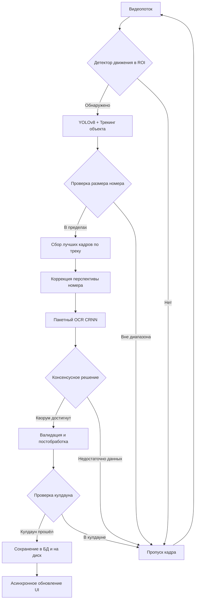

# ANPR System - Automatic Number Plate Recognition


Десктопное приложение для автоматического распознавания автомобильных номеров с поддержкой многоканального видео, локальной базой данных и интеллектуальной обработкой в реальном времени.

## 🚀 Основные возможности

- **Многоканальный мониторинг** — одновременная работа с несколькими видеопотоками (RTSP/файлы/веб-камера)
- **Адаптивная детекция движения** — умный запуск распознавания только при наличии движения в зоне интереса (ROI)
- **Трекинг и агрегация** — отслеживание объектов с голосованием по лучшим кадрам для повышения точности
- **Анализ направления движения** — классификация треков на приближение/удаление по динамике номера
- **Локальное хранение** — SQLite база событий с автоматическим созданием скриншотов
- **Гибкие настройки** — индивидуальная конфигурация для каждого канала (детекция, OCR, постобработка)
- **Переключаемые фильтры** — отдельные тумблеры для ROI и ограничения размеров рамки номера
- **Валидация номеров** — постобработка, коррекция OCR-ошибок и фильтрация по форматам стран с отображением флагов
- **Автоматическое восстановление** — переподключение при потере сигнала и плановый restart потоков
- **Интуитивный редактор ROI** — графическое выделение зоны распознавания прямо на preview
- **Интеллектуальный кэш UI** — пул QPixmap и LRU-кэш изображений событий с контролем потребления памяти
- **Гибкая настройка времени** — коррекция часового пояса и смещения для корректного отображения меток времени
- **Глобальный режим Debug** — единые переключатели оверлеев (рамки, OCR, треки) и онлайн-панель логов в «Наблюдении»

## 📦 Установка

## ✅ Проверенные версии

Проект проверен со следующими версиями окружения:
- **CUDA**: 12.1
- **PyTorch**: 2.8.0
- **torchvision**: 0.23.0
- **torchaudio**: 2.8.0
- **ultralytics**: 8.3.20

### Предварительные требования
- Python 3.13
- pip (менеджер пакетов Python)

### Установка зависимостей

```bash
# Клонирование репозитория
git clone <repository-url>
cd ANPR-System-v0.5

# Установка зависимостей (выберите вариант под ваше железо)

# Для CPU:
pip install -r requirements.txt --index-url https://download.pytorch.org/whl/cpu --extra-index-url https://pypi.org/simple

# Для CUDA 11.8:
pip install -r requirements.txt --index-url https://download.pytorch.org/whl/cu118 --extra-index-url https://pypi.org/simple

# Для CUDA 12.1:
pip install -r requirements.txt --index-url https://download.pytorch.org/whl/cu121 --extra-index-url https://pypi.org/simple
```

## 🎮 Быстрый старт

### Графический интерфейс
```bash
python app.py
```

## 🧹 Завершение работы
- Закрытие окна или выход через системное меню останавливает все фоновые `ChannelWorker`, дожидается завершения их задач и при необходимости принудительно завершает общий процессный пул инференса. Это предотвращает зависание фоновых процессов Python и рост потребления ОЗУ после закрытия приложения.

## 🖥️ Интерфейс приложения

### 1. Вкладка "Наблюдение"
- **Сетка просмотра** — выбор компоновки (1×1, 1×2, 2×2, 2×3, 3×3) с возможностью фокуса на один канал
- **Панель каналов** — отображение видеопотоков с Drag&Drop перестановкой, индикатором движения и последним распознанным номером (занимает 3/4 ширины)
- **Детали события** — предпросмотр полного кадра, кропа номера и метаданных (время, канал, страна, уверенность)
- **Таблица событий** — список последних распознаваний с флагами стран и возможностью детального просмотра
- **Панель логов (Debug)** — при включенном флаге «Лог» в настройках Debug отображает поток текущих логов под сеткой каналов

### 2. Вкладка "Журнал"
- **Поиск по номеру** — поддержка частичного совпадения (LIKE)
- **Фильтр по времени** — выбор интервала дат с помощью удобного календаря
- **Таблица результатов** — расширенный просмотр с сортировкой по всем полям
- **Детальный просмотр** — открытие события в отдельном модальном окне с увеличенными скриншотами

### 3. Вкладка "Настройки"
- **Общие настройки**:
  - Автоматическое переподключение при потере сигнала и по расписанию
  - Пути к БД и папке для скриншотов
  - Сетка просмотра по умолчанию
  - Часовой пояс и коррекция времени
  - Параметры логирования

- **Настройки каналов** (с превью и редактором ROI):
  - Источники видео (RTSP URL, путь к файлу, индекс камеры)
  - Параметры распознавания (бестшоты, кулдаун, мин. уверенность OCR)
  - Режим детекции (постоянный или по движению) с гибкой настройкой детектора
  - Зоны интереса (ROI) с графическим редактором и ручным вводом в процентах
  - Тумблеры включения/выключения ROI и фильтра по размеру рамки
  - Конфигурация валидации номеров (каталог шаблонов и список активных стран)
  - Вкладка **Debug** — глобальные переключатели визуализации детекций/OCR/треков и включение панели логов для всех каналов

## 🏗️ Архитектура системы

```
┌─────────────────────────────────────────────┐
│ Presentation Layer (GUI)                    │ ← main_window.py, app.py
├─────────────────────────────────────────────┤
│ Application Layer (Coordinators)            │ ← channel_worker.py, factory.py
├─────────────────────────────────────────────┤
│ Domain Layer (Core Business Logic)          │ ← anpr_pipeline.py (включая TrackAggregator)
├─────────────────────────────────────────────┤
│ Infrastructure Layer (External Services)    │ ← yolo_detector.py, crnn_recognizer.py
└─────────────────────────────────────────────┘
```

## 🔧 Технологический стек

### Детекция номеров
- **YOLOv8** — нейросеть для обнаружения номерных знаков
- **Встроенный трекинг YOLOv8** — алгоритм сопровождения объектов с уникальными ID
- **Автоматический откат** — при ошибках трекера система автоматически переключается на чистую детекцию

### Распознавание текста
- **CRNN (INT8-квантизация)** — свёрточная рекуррентная сеть для OCR, оптимизированная с помощью PyTorch FX
- **Препроцессинг** — выделен в отдельный модуль с гибридной коррекцией наклона/перспективы (контуры + Hough), CLAHE, адаптивной бинаризацией и морфологией с fallback на исходное изображение
- **Вероятность OCR** — оценка уверенности в распознавании на уровне символов и их усреднение (0..1)

### Валидация и постобработка
- **Модульная система шаблонов** — YAML-конфиги для каждой страны с регулярными выражениями, правилами валидации и коррекции
- **Исправление типичных ошибок OCR** — предопределённые замены цифр↔буквы и частых опечаток
- **Фильтрация невалидных номеров** — несоответствующие формату страны распознавания строки очищаются до пустых значений, а треки сбрасываются, чтобы в UI оставались только валидированные номера

## 📊 Процесс обработки



Проверка кулдауна выполняется внутри `ANPRPipeline` в процессе инференса, поэтому каждый номер подавляется ровно одним кешем на канал без дополнительной фильтрации в потоковом воркере.

## ⚙️ Конфигурация

### Параметры трекинга (настраиваются для каждого канала)
```json
{
  "best_shots": 5,                 // Количество кадров для голосования по треку
  "cooldown_seconds": 30,          // Время подавления повторов для одного номера
  "ocr_min_confidence": 0.7,       // Минимальная уверенность OCR для принятия результата
  "detector_frame_stride": 3       // Запуск YOLO на каждом N-м кадре (для производительности)
}
```

### Управление ROI и фильтром по размеру
- `roi_enabled` — включает/выключает использование пользовательской зоны ROI; при `false` поиск ведётся по всему кадру.
- `size_filter_enabled` — включает/выключает фильтр по минимальному/максимальному размеру рамки; при `false` границы размера игнорируются.
- `min_plate_size` / `max_plate_size` — рабочий диапазон размеров рамки в пикселях (учитывается только когда фильтр включён).
- **Единый формат ROI** — конфигурация всегда хранится в виде списка точек с единицей измерения (`px` или `percent`). Наследие (`x/y/width/height`) автоматически нормализуется в прямоугольник с четырьмя точками.
- **Нормализация ROI в процентах** — при сохранении зона пересчитывается относительно предпросмотра, чтобы корректно масштабироваться под реальное разрешение кадра и не терять детекции на разных потоках.
- **Дефолт** — преднастроенный прямоугольник (`DEFAULT_ROI_POINTS`) создаётся для новых каналов и при отсутствии валидных точек, чтобы поведение сохранялось при миграциях.
- **Round-trip** — сохранённые ROI повторно загружаются без изменения точек, что зафиксировано юнит-тестами нормализации.

### Определение направления движения
- **Источники данных** — история рамок гос. номера по треку (центр и площадь bounding box).
- **Классификация** — APPROACHING (к камере), если доминирует вертикальное смещение вниз/рост рамки; RECEDING (от камеры), если смещение вверх/сжатие рамки.
- **Устойчивость** — анализ последних N кадров трека с подавлением шумов: малые колебания площади и позиции игнорируются, пока не накоплена достаточная длина истории.
- **Интеграция** — рассчитанное направление сохраняется вместе с событием, отображается в таблицах событий и в журнале поиска.

### Единый источник дефолтов настроек
- **SettingsManager** экспортирует функции `direction_defaults()` и `plate_size_defaults()` (`anpr/infrastructure/settings_manager.py`) как единственную точку правды для начальных значений направления и фильтра размеров номера.
- **Переиспользование** — `DirectionSettings.from_dict` и `PlateSize.from_dict` получают значения именно из этих функций, чтобы изменение дефолтов затрагивало воркеры, миграции настроек и тесты без ручной синхронизации.
- **Проверка консистентности** — юнит-тесты фиксируют соответствие классов настроек и экспортируемых дефолтов, предотвращая расхождения при правках.

### Детектор движения
- **Частота анализа** — обработка каждого N-го кадра (`motion_frame_stride`)
- **Порог срабатывания** — минимальная доля изменённых пикселей в ROI (`motion_threshold`)
- **Гистерезис** — кадры для устойчивого включения (`activation_frames`) и выключения (`release_frames`) режима распознавания
- **Автосброс состояния** — при смене разрешения кадра или размеров ROI (например, после переподключения потока или изменения настроек) детектор очищает буферы и начинает сравнение заново, предотвращая ошибки OpenCV из-за несовпадения размеров.

### Валидация номеров
- Шаблоны стран лежат в каталоге `config/countries` и загружаются из YAML-файлов (например, `russia.yaml`, `ukraine.yaml`).
- В общих настройках можно выбрать каталог и активные страны; при отсутствии конфигов включается прозрачный проход без фильтрации.
- Для каждого шаблона задаются регулярные выражения форматов, допустимые символы, стоп-слова, недопустимые последовательности и правила коррекции OCR (замены цифр на буквы и наоборот).
- Постпроцессинг выполняется после консенсуса по треку, поэтому валидатор не обрабатывает каждый бестшот и не влияет на производительность трекинга.

## 💾 Хранение данных

- **База данных** — SQLite (`data/db/anpr.db` по умолчанию, путь настраивается)
- **Схема таблицы `events`**:
  - `id` — уникальный идентификатор (INTEGER PRIMARY KEY)
  - `timestamp` — время события в UTC (TEXT, ISO format)
  - `channel` — имя канала (TEXT)
  - `plate` — распознанный и нормализованный номер (TEXT)
  - `country` — код страны для валидации и отображения флага (TEXT, NULLABLE)
  - `confidence` — уверенность распознавания OCR (REAL)
  - `direction` — направление движения (TEXT, APPROACHING/RECEDING/UNKNOWN)
  - `source` — источник видеопотока (TEXT)
  - `frame_path` — путь к сохранённому полному кадру (TEXT, NULLABLE)
  - `plate_path` — путь к сохранённому кропу номера (TEXT, NULLABLE)

- **Скриншоты** — автоматическое сохранение в настраиваемую папку (формат: `{timestamp}_{channel}_{plate}_{uuid}_frame/plate.jpg`)
- **Асинхронная запись** — операции с базой и диском выполняются в отдельных потоках/процессах и не блокируют видеопотоки

## 📁 Структура проекта

```
ANPR-System-v0.6/
├── .gitignore                # Шаблон игнорирования временных файлов и артефактов
├── app.py                    # Точка входа (GUI)
├── requirements.txt          # Зависимости Python
├── settings.json             # Конфигурация приложения (автоматически создаётся; каналы, ROI, фильтры)
│
├── config/                   # Форматы номеров стран
│   └── countries/
│       ├── belarus.yaml
│       ├── kazakhstan.yaml
│       ├── russia.yaml
│       └── ukraine.yaml
│
├── models/                   # Папка для весов моделей (должны быть добавлены пользователем)
│   ├── ocr_crnn/
│   │   └── crnn_ocr_model_int8_fx.pth
│   └── yolo/
│       └── best.pt
│
├── images/                   # Статические ресурсы (например, флаги стран)
│   └── flags/
│       ├── ru.png
│       ├── ua.png
│       └── ...
│
├── tests/                    # Юнит-тесты (заглушки окружения, проверки ROI и дефолтов)
│   ├── conftest.py           # Общие заглушки для cv2, PyQt5 и ultralytics
│   ├── test_defaults_consistency.py  # Проверка единого источника дефолтов настроек
│   └── test_region_normalization.py  # Тесты нормализации и round-trip ROI
│
└── anpr/                     # Основной пакет приложения
    ├── __init__.py
    ├── config.py             # Константы путей к моделям и пороги
    │
    ├── infrastructure/       # Инфраструктурный слой
    │   ├── __init__.py
    │   ├── logging_manager.py  # Централизованный менеджер логирования с ротацией
    │   ├── settings_manager.py # Управление настройками с миграцией версий
    │   └── storage.py          # Синхронный и асинхронный доступ к SQLite БД
    │
    ├── detection/            # Детекция объектов
    │   ├── __init__.py
    │   ├── motion_detector.py # Детектор движения на основе вычитания фона
    │   └── yolo_detector.py   # Обёртка для YOLOv8 с трекингом и откатом
    │
    ├── pipeline/             # Пайплайн обработки
    │   ├── __init__.py
    │   ├── anpr_pipeline.py   # Основной пайплайн (агрегация по трекам, валидатор и кулдаун по номерам в процессе инференса)
    │   └── factory.py         # Фабрика для создания компонентов с общим OCR
    │
    ├── preprocessing/        # Предобработка кропов номера
    │   ├── __init__.py
    │   └── plate_preprocessor.py # Коррекция наклона и перспективы перед OCR
    │
    ├── postprocessing/       # Валидация и нормализация номеров
    │   ├── __init__.py
    │   ├── country_config.py  # Загрузчик YAML-конфигов стран
    │   └── validator.py       # Валидатор и корректор распознанных номеров
    │
    ├── recognition/          # Распознавание текста
    │   ├── __init__.py
    │   ├── crnn.py           # Архитектура CRNN модели
    │   └── crnn_recognizer.py # Обёртка для загрузки и инференса квантованной модели
    │
    ├── ui/                   # Пользовательский интерфейс
    │   ├── __init__.py
    │   └── main_window.py    # Главное окно (наблюдение, журнал, настройки) и управление жизненным циклом воркеров
    │
    └── workers/              # Фоновые процессы
        ├── __init__.py
        └── channel_worker.py # Воркер для асинхронной обработки видеопотока, инференса и процессного пула
```

## 🛠️ Разработка

### Принципы проектирования
- **SOLID** — разделение ответственности между компонентами
- **DRY** — отсутствие дублирования кода
- **KISS** — простота реализации и поддержки
- **Многослойная архитектура** — чёткое разделение на UI, логику, данные и инфраструктуру

### Логирование
- Ротация лог-файлов через `RotatingFileHandler` (настройки в `settings.json`)
- Настраиваемые уровни детализации (DEBUG, INFO, WARNING, ERROR)
- Единый формат записей с меткой времени, именем модуля и уровнем

### Ключевые оптимизации
- **Адаптивный инференс** — шаг обработки кадров (`frame_stride`) для снижения нагрузки на CPU/GPU
- **Консенсусное распознавание** — голосование по нескольким кадрам трека для надёжности
- **Подавление повторов** — таймер кулдауна в `ANPRPipeline` с единым кэшем на канал внутри процесса инференса; UI-воркер не добавляет дополнительный слой подавления
- **Батчевый OCR** — группировка кропов номеров в батчи для ускорения инференса CRNN
- **Пул QPixmap и LRU-кэш** — повторное использование буферов отрисовки и умное управление памятью для изображений событий
- **Process Pool для OCR** — изоляция загрузки моделей и инференса в отдельных процессах для стабильности

## 🔍 Поиск и фильтрация (Вкладка "Журнал")

1.  **По номеру** — поддержка частичного совпадения (LIKE `%фрагмент%`)
2.  **По времени** — точный интервал с помощью виджетов выбора даты и времени
3.  **По каналу** — фильтрация по источнику видео (через общий запрос с фильтром по времени/номеру)
4.  **По уверенности** — отбор по минимальному порогу OCR (реализовано на уровне SQL-запроса)

## 🚧 Планируемые улучшения

1.  **Фильтрация по размеру** — исключение из обработки слишком маленьких или слишком больших детекций для повышения точности OCR.
2.  **Определение направления движения** — анализ траектории трека для классификации движения как "приближение" или "удаление".

## ⚠️ Важные примечания

- **Требует предобученных моделей** — файлы `models/yolo/best.pt` и `models/ocr_crnn/crnn_ocr_model_int8_fx.pth` должны быть предоставлены пользователем.
- **Поддержка стран** — система валидации по умолчанию настроена на форматы России, Украины, Беларуси и Казахстана. Добавление новых стран требует создания соответствующих YAML-файлов в `config/countries/`.
- **Производительность** — высокая нагрузка при работе с большим количеством HD-каналов. Рекомендуется настройка `detector_frame_stride` и использование аппаратного ускорения (CUDA).
- **Стабильность RTSP** — для сетевых потоков требуется стабильное соединение. Используйте встроенные механизмы переподключения.

## 📄 Лицензия

MIT License

## 🤝 Вклад в проект

1.  Форкните репозиторий
2.  Создайте ветку для новой функциональности (`git checkout -b feature/amazing-feature`)
3.  Внесите изменения и добавьте тесты
4.  Убедитесь, что код соответствует стилю и проходит существующие тесты
5.  Зафиксируйте изменения (`git commit -m 'Add some amazing feature'`)
6.  Отправьте в форк (`git push origin feature/amazing-feature`)
7.  Откройте Pull Request

## 📞 Поддержка

По вопросам использования, предложениям и сообщениям об ошибках создавайте Issues в репозитории проекта.
